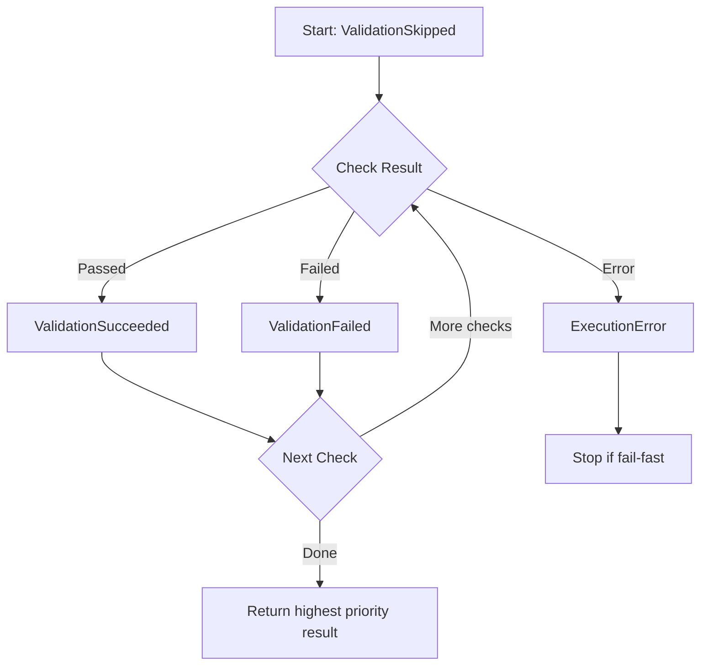

## Exit Code Overview

Check Image uses three exit codes to communicate validation results and execution status:

| Exit Code | Status | Meaning |
|-----------|--------|----------|
| **0** | Success | Validation passed or no checks were run |
| **1** | Validation Failed | Image did not meet validation requirements |
| **2** | Execution Error | Tool encountered an error during execution |

## Exit Code Semantics

### Exit 0 - Success

Returned when:
- All validation checks passed successfully
- No checks were run (`ValidationSkipped` state)
- All requested checks are explicitly skipped via `--skip`

**Examples:**

```bash
# Image passes validation
check-image age nginx:latest --max-age 90
echo $?  # 0

# All checks skipped
check-image all nginx:latest --skip age,size,ports,registry,root-user,healthcheck,secrets,labels,entrypoint,platform
echo $?  # 0
```

### Exit 1 - Validation Failed

Returned when:
- Image does not meet validation criteria
- One or more checks fail validation
- Image violates security or operational standards

**Examples:**

```bash
# Image is too old
check-image age old-image:legacy --max-age 30
# Output: Image is 180 days old (max: 30)
echo $?  # 1

# Image runs as root
check-image root-user vulnerable:latest
# Output: Image runs as root user
echo $?  # 1

# Image exposes unauthorized ports
check-image ports nginx:latest --allowed-ports 443
# Output: Image exposes unauthorized ports: 80
echo $?  # 1
```

### Exit 2 - Execution Error

Returned when:
- Image not found in registry or local daemon
- Invalid configuration file syntax
- Missing required flags or arguments
- Policy file format errors
- Authentication failures
- Network connectivity issues
- Invalid regular expressions in label patterns

**Examples:**

```bash
# Image not found
check-image age nonexistent/image:tag
# Output: Error: failed to fetch image: not found
echo $?  # 2

# Invalid policy file
check-image registry nginx:latest --registry-policy invalid.json
# Output: Error: error reading registry policy: invalid JSON
echo $?  # 2

# Missing required flag
check-image registry nginx:latest
# Output: Error: --registry-policy is required
echo $?  # 2

# Malformed regex pattern
check-image labels nginx:latest --labels-policy broken-pattern.yaml
# Output: Error: invalid pattern: error parsing regexp
echo $?  # 2
```

## Precedence in `all` Command

When running multiple checks with the `all` command, exit code precedence determines the final result:

**Precedence Order** (highest to lowest):
1. **Exit 2** - Execution Error (`ExecutionError`)
2. **Exit 1** - Validation Failed (`ValidationFailed`)
3. **Exit 0** - Validation Succeeded (`ValidationSucceeded`)
4. **Exit 0** - Validation Skipped (`ValidationSkipped`)

### How Precedence Works

**Scenario 1: Mixed Results**

If some checks fail validation and others pass:

```bash
check-image all nginx:latest --max-age 10
# age: FAILED (image is 30 days old)
# size: PASSED
# root-user: PASSED
# Exit code: 1 (validation failed)
```

**Scenario 2: Execution Error Takes Precedence**

If some checks have execution errors and others fail validation:

```bash
check-image all nginx:latest --registry-policy invalid.json
# registry: ERROR (invalid policy file)
# root-user: FAILED (runs as root)
# size: PASSED
# Exit code: 2 (execution error takes precedence over validation failure)
```

**Scenario 3: All Checks Pass**

```bash
check-image all nginx:latest --skip registry,labels,platform
# age: PASSED
# size: PASSED
# ports: PASSED
# root-user: PASSED
# healthcheck: PASSED
# secrets: PASSED
# entrypoint: PASSED
# Exit code: 0 (all checks passed)
```

**Scenario 4: All Checks Skipped**

```bash
check-image all nginx:latest --include ""
# No checks run
# Exit code: 0 (validation skipped)
```

### Implementation Details

The precedence is enforced by the `ValidationResult` type in `cmd/check-image/commands/root.go`:

```go
type ValidationResult int

const (
    ValidationSkipped ValidationResult = iota  // 0
    ValidationSucceeded                         // 1
    ValidationFailed                            // 2
    ExecutionError                              // 3
)
```

Higher numeric values have higher priority. The `UpdateResult()` function ensures the global `Result` variable always reflects the highest-priority outcome.

## Shell Scripting Examples

### Basic Exit Code Handling

```bash
#!/bin/bash

check-image age nginx:latest --max-age 30

case $? in
  0)
    echo "✓ Image passed validation"
    ;;
  1)
    echo "✗ Image failed validation"
    exit 1
    ;;
  2)
    echo "✗ Error running validation"
    exit 2
    ;;
esac
```

### CI/CD Pipeline Example

```bash
#!/bin/bash
set -e

IMAGE="myapp:${CI_COMMIT_SHA}"

echo "Validating image: $IMAGE"

if ! check-image all "$IMAGE" --config .check-image/config.yaml; then
  case $? in
    1)
      echo "Image validation failed - blocking deployment"
      exit 1
      ;;
    2)
      echo "Validation error - check configuration"
      exit 2
      ;;
  esac
fi

echo "Image validation passed - proceeding with deployment"
```

### Multiple Check Strategy

```bash
#!/bin/bash

IMAGE="nginx:latest"
FAILED=0

# Run critical checks
echo "Running critical security checks..."
check-image root-user "$IMAGE" || FAILED=1
check-image secrets "$IMAGE" || FAILED=1

# Run operational checks (non-blocking)
echo "Running operational checks..."
check-image age "$IMAGE" --max-age 90 || echo "Warning: Image age check failed"
check-image size "$IMAGE" --max-size 500 || echo "Warning: Image size check failed"

if [ $FAILED -eq 1 ]; then
  echo "Critical checks failed"
  exit 1
fi

echo "All critical checks passed"
```

### Parallel Validation

```bash
#!/bin/bash

IMAGE="myapp:latest"

# Run checks in parallel
check-image age "$IMAGE" --max-age 90 &
PID_AGE=$!

check-image root-user "$IMAGE" &
PID_ROOT=$!

check-image secrets "$IMAGE" &
PID_SECRETS=$!

# Wait for all checks
FAILED=0
wait $PID_AGE || FAILED=1
wait $PID_ROOT || FAILED=1
wait $PID_SECRETS || FAILED=1

if [ $FAILED -eq 1 ]; then
  echo "One or more checks failed"
  exit 1
fi

echo "All checks passed"
```

### Soft Failure with Logging

```bash
#!/bin/bash

IMAGE="nginx:latest"
LOG_FILE="validation.log"

check-image all "$IMAGE" --config config.yaml -o json > "$LOG_FILE" 2>&1
RESULT=$?

if [ $RESULT -eq 0 ]; then
  echo "✓ Validation passed"
elif [ $RESULT -eq 1 ]; then
  echo "⚠ Validation failed (non-blocking)"
  jq '.checks[] | select(.passed == false)' "$LOG_FILE"
  # Continue anyway
  exit 0
else
  echo "✗ Execution error"
  cat "$LOG_FILE"
  exit 2
fi
```

### Fail-Fast vs Continue-on-Error

```bash
#!/bin/bash

IMAGE="myapp:${VERSION}"

# Fail-fast: stop on first failure
echo "Running fail-fast validation..."
if check-image all "$IMAGE" --fail-fast --config config.yaml; then
  echo "Fast validation passed"
else
  echo "Fast validation failed (exit $?)"
  exit 1
fi

# Continue-on-error: run all checks
echo "Running complete validation..."
check-image all "$IMAGE" --config config.yaml -o json > results.json
RESULT=$?

if [ $RESULT -ne 0 ]; then
  echo "Complete validation result: exit $RESULT"
  jq '.summary' results.json
fi
```

## ValidationResult States

The internal `ValidationResult` enum represents check outcomes:

```go
type ValidationResult int

const (
    ValidationSkipped   ValidationResult = iota // No checks run
    ValidationSucceeded                         // All checks passed
    ValidationFailed                            // One or more checks failed
    ExecutionError                              // Execution error occurred
)
```

### State Transitions in `all` Command



### Result Update Logic

The `UpdateResult()` helper in `root.go` ensures correct precedence:

```go
func UpdateResult(current ValidationResult, new ValidationResult) ValidationResult {
    // Higher value = higher priority
    if new > current {
        return new
    }
    return current
}
```

**Example progression:**

1. Initial: `ValidationSkipped` (0)
2. First check passes: `ValidationSucceeded` (1) — higher priority
3. Second check fails: `ValidationFailed` (2) — higher priority
4. Third check errors: `ExecutionError` (3) — highest priority
5. Final exit code: **2** (ExecutionError)

## Best Practices

### 1. Always Check Exit Codes

```bash
# ✗ Bad - ignores failures
check-image age nginx:latest

# ✓ Good - handles exit codes
if ! check-image age nginx:latest; then
  echo "Validation failed"
  exit 1
fi
```

### 2. Distinguish Validation Failures from Errors

```bash
check-image all "$IMAGE" --config config.yaml
RESULT=$?

if [ $RESULT -eq 1 ]; then
  # Validation failure - image issue
  echo "Image does not meet requirements"
elif [ $RESULT -eq 2 ]; then
  # Execution error - configuration or environment issue
  echo "Check configuration and environment"
fi
```

### 3. Use JSON Output for Detailed Analysis

```bash
check-image all nginx:latest -o json > results.json
RESULT=$?

if [ $RESULT -ne 0 ]; then
  # Parse specific failures
  jq -r '.checks[] | select(.passed == false) | "\(.check): \(.message)"' results.json
fi
```

### 4. Set Appropriate CI/CD Exit Behavior

```yaml
# GitHub Actions example
- name: Validate image
  id: validate
  continue-on-error: true
  run: check-image all ${{ env.IMAGE }} --config config.yaml

- name: Handle validation result
  if: steps.validate.outcome == 'failure'
  run: |
    if [ ${{ steps.validate.conclusion }} == 'failure' ]; then
      echo "Validation failed - review image"
      # Decide whether to block deployment
    fi
```

## Next Steps

<CardGroup cols={2}>
  <Card title="Policy Configuration" icon="shield" href="/advanced/policies">
    Learn about policy file structure and validation rules
  </Card>
  <Card title="Troubleshooting" icon="wrench" href="/advanced/troubleshooting">
    Common issues and solutions
  </Card>
</CardGroup>